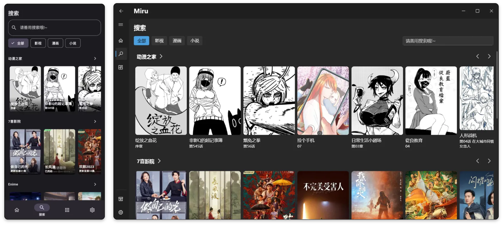

[简体中文](README-zh.md) | [English](README.md) | [日本語](README-ja.md) | [Русский](README-ru.md) | [Беларуская](README-be.md) | [Українська](README-uk.md)


<p align="center">

</p>

<h1 align="center">
Miru App
</h1>

<p align="center">ちゃーが、まんが、しーょうしちぬかくちょうソースサポートしー、Android、Windows、Webんかいたいおうさんむりょうぬオープンソースぬたちぬーアプリケーション。</p>

<h1 align="center">

[](https://github.com/miru-project/miru-app/releases/latest)
[](https://github.com/miru-project/miru-app/blob/main/LICENSE)
[](https://github.com/miru-project/miru-app/stargazers)
[](https://github.com/miru-project/miru-app/releases/latest)

</h1>



## とぅくはべる

- `windows`んでぃ`android`サポート
- フレンドリーなかくはべるちぬーぬさくせいサポート、デバッグログ
- かくはべるちぬーやJavaScriptしーようしうぅい、かいはちがかなーちゃるさぁ
- カスタムかくはべるリポジトリぬサポート
- かんしきぬかくはべるちぬーリポジトリぬビデオフィードていきょうそーくとぅ、うりちかいんでぃかくはべるちぬーかくふぃちよおーあいびらん
- ちゃーが、まんが、しーょうしちなどぅぬふくすうソースぬストリーミングサポートしー、ふくすーいるプラットフォームぬとうごうじちぎん
- システムUIぬデザインぎんぐとううぅいち
- TMDBメタデータじょうほうじちゃーてぃきんかいしゅとぅく

## Todo

- [x] BTトレント
- [ ] ゆりゆたさるデバッグツール
- [ ] データぬちゃーき
- [ ] じまちゅるぬじちゃーきんさく

## インストール

うぬたみねー、[くまから](https://github.com/miru-project/miru-app/releases/latest)さいしんばんぬインストールパッケージダウンロードすが、いかぬほうほうっしぐじしんでぃビルドしみそーれー 

## かんちく

### Flutterインストールすん

くまさんさ [Flutterこうしきドキュメント](https://flutter.dev/docs/get-started/install)

### いずんかんけいインストールすん

```bash
flutter pub get
```

### うぐかすん

```bash
flutter run
```

### パック

Android

```bash
flutter build apk
```

Windows

```bash
flutter build windows
```

## Linuxにちいてぃ

ぎんじてぃんでーLinuxっしはいどーんかんけいぬむんだいにゆりquickjsきどうならんたみ、とうみんぬえーじゃサポートたいさがいとぅなやびーん。


## こうきん

いかくくむん、あらゆるしゅるいぬこうきんかんぎうぅいさびーん。

- ていあん
- バグてぃがろーフィードバック
- コード
- ぶんしょさくせい


## コミュニケーション

Telegram：https://t.me/MiruChat

Telegramチャンネル：https://t.me/MiruChannel
