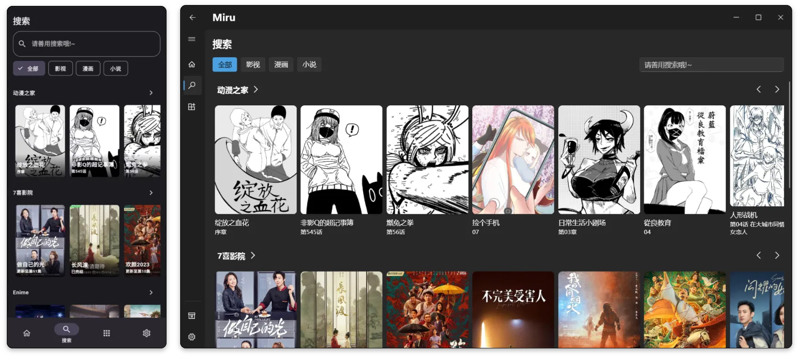

**English** | [简体中文](README-zh.md) | [日本語](README-ja.md) | [うちなーぐち](README-ryu.md) | [Русский](README-ru.md) | [Беларуская](README-be.md) | [Українська](README-uk.md) | [हिन्दी](README.hi.md)

<div align="center">
  
</div>

<h1 align="center">Miru ऐप</h1>

<p align="center">एक मुफ़्त और ओपन-सोर्स मल्टी-फंक्शनल एप्लिकेशन जो Android, Windows, और Web के लिए वीडियो, कॉमिक्स, नॉवेल एक्सटेंडेड सोर्स को सपोर्ट करता है।</p>

<div align="center">

[](https://github.com/miru-project/miru-app/releases/latest)
[](https://github.com/miru-project/miru-app/blob/main/LICENSE)
[](https://github.com/miru-project/miru-app/stargazers)
[](https://github.com/miru-project/miru-app/releases/latest)

</div>



## विशेषताएँ

- `windows` और `android` के लिए सपोर्ट
- अनुकूल एक्सटेंशन राइटिंग सपोर्ट, डीबग लॉग
- एक्सटेंशन JavaScript भाषा का उपयोग करता है, और डेवलपमेंट सरल है
- कस्टम एक्सटेंशन रिपॉजिटरी के लिए सपोर्ट
- आधिकारिक एक्सटेंशन रिपॉजिटरी वीडियो सोर्स प्रदान करती है, जिसे बिना कोई एक्सटेंशन लिखे इस्तेमाल किया जा सकता है
- वीडियो, कॉमिक्स और नॉवेल के कई स्रोतों को ऑनलाइन देखने के लिए सपोर्ट, कई प्लेटफार्मों का एकीकरण
- सिस्टम UI की डिज़ाइन भाषा को एकीकृत करें
- TMDB मेटाडेटा जानकारी स्वचालित रूप से प्राप्त करें
- AniList ट्रैकिंग के लिए सपोर्ट
- प्रॉक्सी सर्वर प्रोटोकॉल (HTTP, SOCKS4, SOCKS5) के लिए सपोर्ट

## करने योग्य (Todo)

- [x] BT टोरेंट
- [x] बेहतर डीबगिंग टूल
- [ ] डेटा सिंक्रनाइज़ेशन
- [ ] स्वचालित रूप से सबटाइटल खोजना

## इंस्टॉल करना

आप [रिलीज़](https://github.com/miru-project/miru-app/releases/latest) पेज से इंस्टॉलेशन पैकेज का नवीनतम संस्करण डाउनलोड कर सकते हैं, या निम्नलिखित विधि द्वारा इसे स्वयं बिल्ड कर सकते हैं

## बिल्ड करना

### Flutter इंस्टॉल करें

कृपया [Flutter की आधिकारिक डॉक्यूमेंटेशन](https://flutter.dev/docs/get-started/install) देखें।

### डिपेंडेंसी इंस्टॉल करें

```bash
flutter pub get
```
###रन करें

```bash
flutter run
```

###सही प्लेटफॉर्म के लिए बिल्ड करें

Android
```bash
flutter build apk
```

Windows
```bash
flutter build windows
```

## Linux के बारे में

वर्तमान में, Linux डिपेंडेंसी समस्याओं के कारण quickjs को प्रारंभ नहीं कर सकता है, इसलिए यह फिलहाल समर्थित नहीं है

## योगदान

किसी भी प्रकार का योगदान स्वागत योग्य है, जिसमें शामिल हैं (लेकिन इन्हीं तक सीमित नहीं):

## सुझाव देना

-बग फीडबैक

-कोड योगदान

-डॉक्यूमेंट लिखना

## अतिरिक्त लिंक

Telegram: https://t.me/MiruChat
