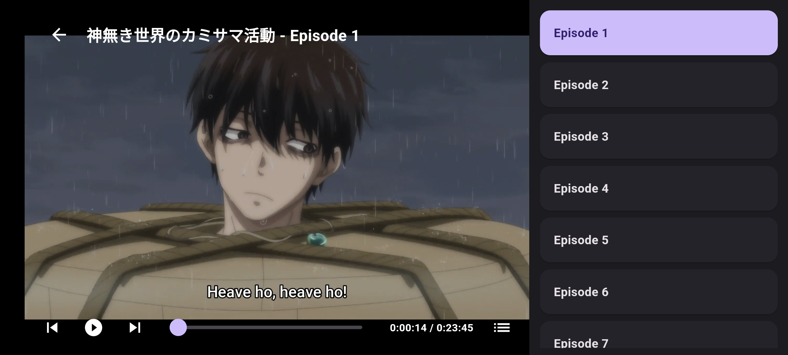
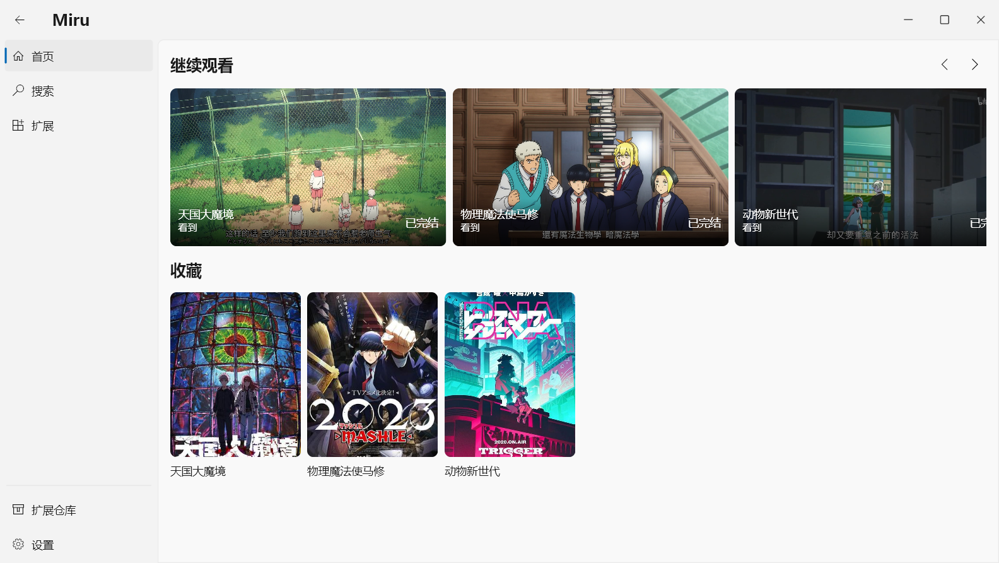
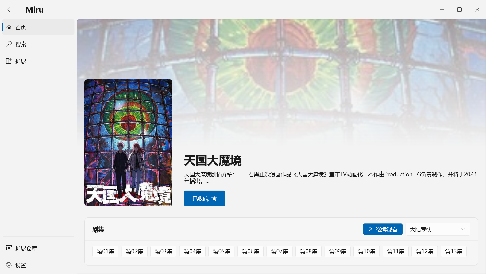
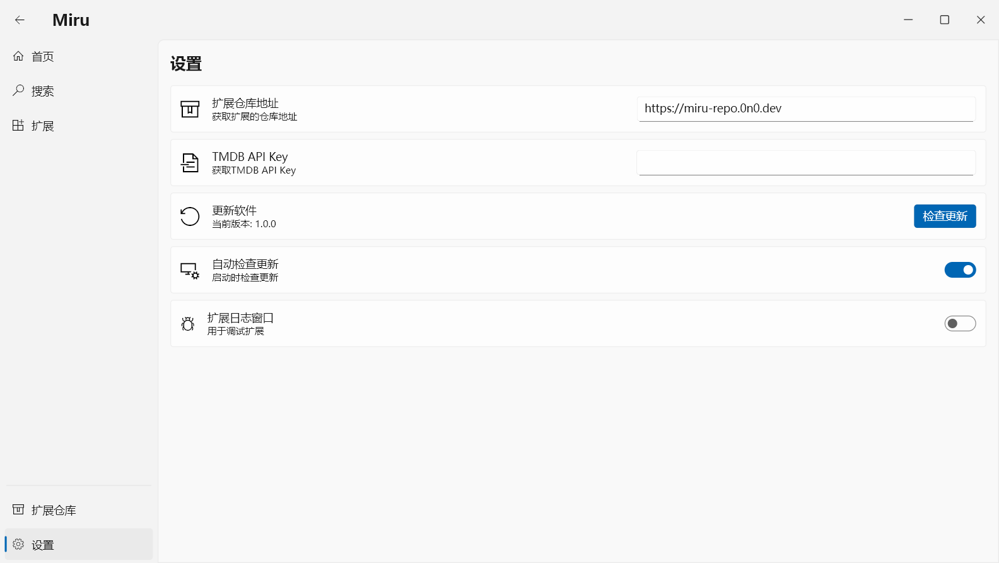

# Miru App

## 特性

- 支持 `windows`,`android`,`linux`
- 友好的扩展编写支持、调试日志
- 支持自定义扩展仓库
- 官方扩展仓库提供视频源，无需编写任何扩展即可使用.
- 支持在线观看多种视频、漫画、小说源，实现多平台的统一。
- 统一系统 UI 的设计语言

## 截图

|android|||
|  :-----: |  :-----: |  :-----: |
|| | |
|| 
|windows/linux|||
||||
|||