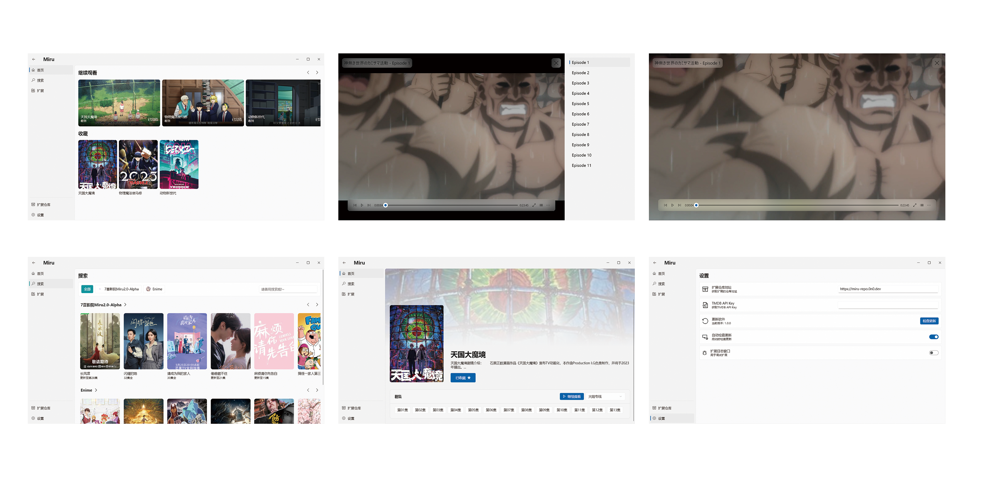

<h1 align="center">
Miru App
</h1>

<h1 align="center">

</h1>

## 特性

- 支持 `windows`,`android`,`linux`
- 友好的扩展编写支持、调试日志
- 扩展使用 JavaScript 语言，开发简单
- 支持自定义扩展仓库
- 官方扩展仓库提供视频源，无需编写任何扩展即可使用
- 支持在线观看多种视频、漫画、小说源，实现多平台的统一
- 统一系统 UI 的设计语言

## Todo

- [x] Windows 支持
- [x] Android 支持
- [x] ~~Linux 支持~~
- [ ] 字幕
- [ ] BT 种子播放
- [x] 漫画支持
- [x] 小说支持
- [x] 影视支持
- [ ] TMDB 元数据
- [ ] 数据同步
- [x] i18n 国际化
- [x] 扩展设置
- [ ] 漫画小说视频设置
- [ ] 漫画小说历史记录
- [ ] 影视播放记录

## 截图

### Android

### Windows

## 关于 Linux

目前 Linux 因为依赖问题导致无法启动 quickjs 所以暂时不支持了

## 交流

Telegram: https://t.me/MiruChat

Telegram 频道: https://t.me/MiruChannel
